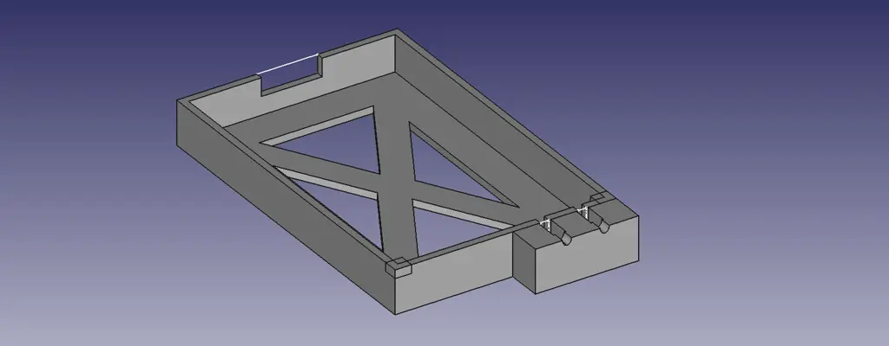
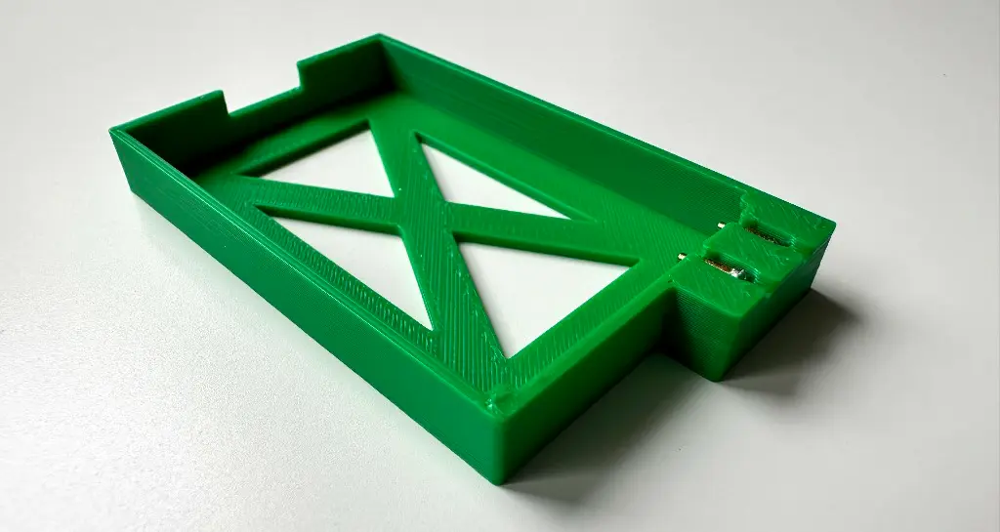
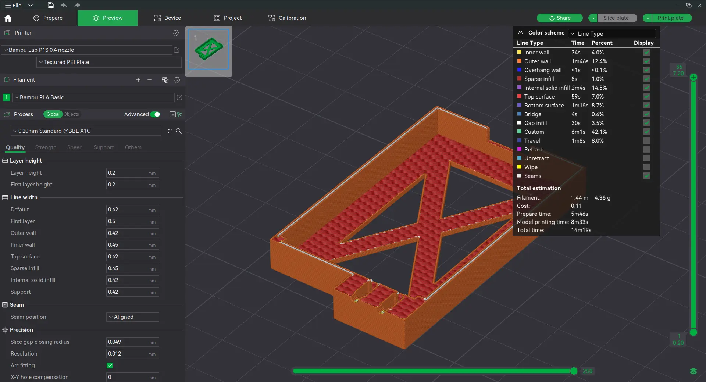
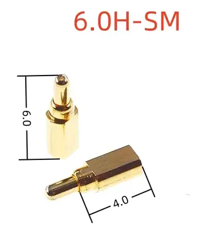
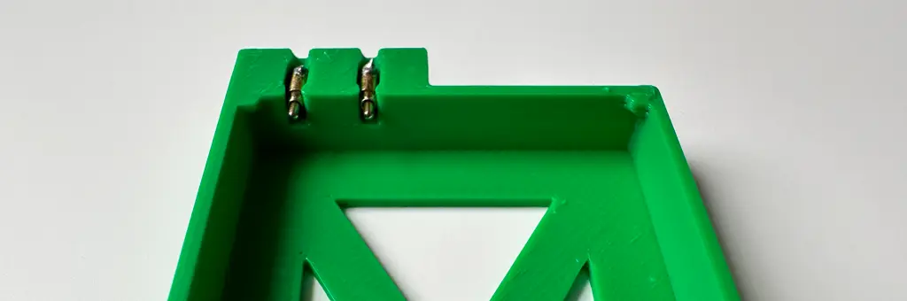

# Nokia BL5C battery holder
The project is created in FreeCAD 0.21.1 and requires two pogo pins to connect to the positive and negative terminals of the installed battery. The wall thickness of the model is 1.2mm.

## Download STL model
You can download the full model in STL format on the [Releases](https://github.com/HexRx/nokia_bl5c_battery_holder/releases) page.

## Slicer settings
The Bambu Studio slicer was used to print the battery holder model with the default settings for 0.4mm nozzle, the model prints in about 14 minutes and requires 4.36g of PLA plastic.

## Pogo pins characteristics
The model uses two pogo pins. Pogo pins should be semi-rectangular in shape and 6.0mm in height:

You can find them on AliExpress https://www.aliexpress.com/item/4000495200194.html

The pogo should be inserted into the holes as shown in the photo below:

## License
This project is licensed under the MIT License - see the [LICENSE](/LICENSE) file for details.